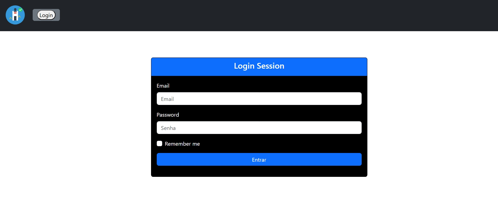
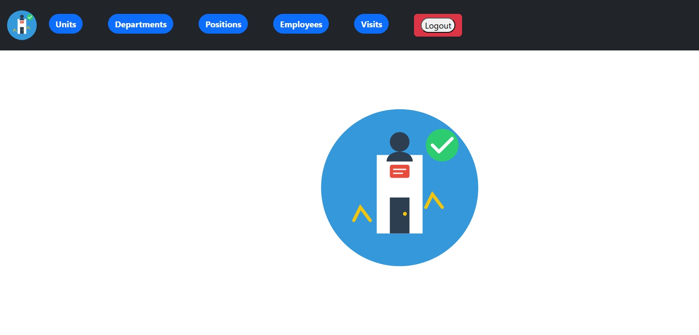
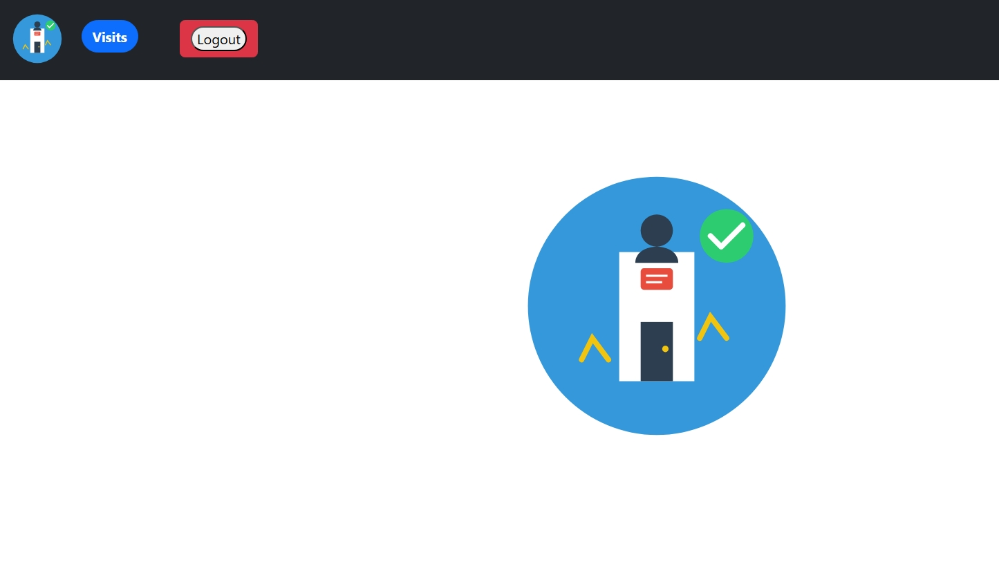
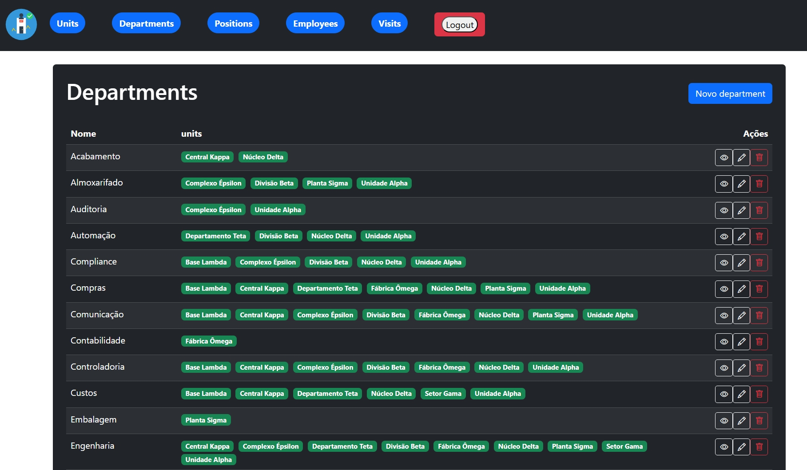
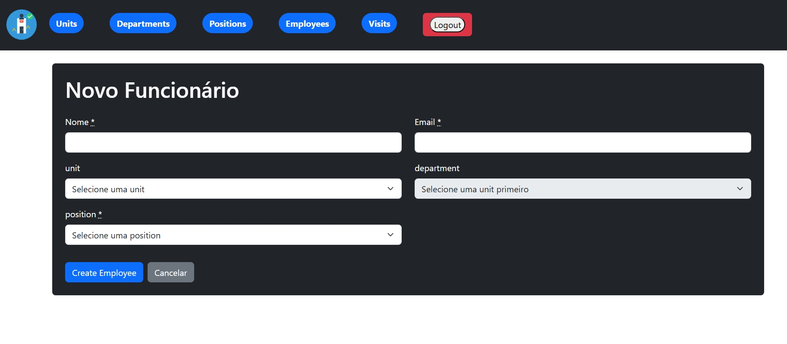
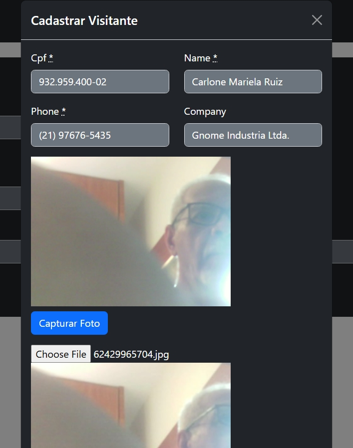
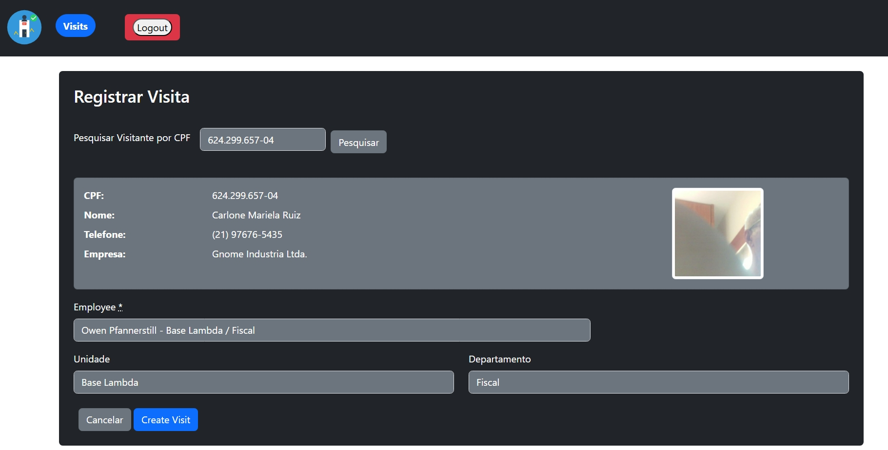

# README

## Gerenciamento de Visitantes

Este é um projeto em Rails 7, para gerenciamento de visitantes, permitindo o cadastro de visitantes, de visitas e controle de acesso. Ele utiliza uma webcam para capturar fotos dos visitantes durante o cadastro e armazena os dados no banco de dados e as fotos no AWS S3.

### Views

## Pagina Principal

## Pagina Principal Admin

## Pagina Principal Attendant

## Department Index

## Employee New

## Visitor new

## Visit nnew

Funcionalidades Principais

    Cadastro de Visitantes:

        Nome completo

        CPF

        Telefone

        Empresa

        Captura de foto através da webcam (webcam.js)

        Visualização da foto antes da confirmação

        Armazenamento dos dados no banco de dados

        Armazenamento da foto no AWS S3

    Cadastro de Visitas:

        Associação com um visitante

        Seleção do funcionário a ser visitado (com autocompletar)

    Cadastro de Entidades:

        Unidades (Units)

        Departamentos (Departments)

        Cargos (Positions)

        Funcionários (Employees)

    Autenticação e Autorização:

        Autenticação via Devise

        Controle de acesso baseado em roles (admin, attendant)

Tecnologias Utilizadas

    Ruby on Rails: Framework web.

    Ruby: Linguagem de programação

    Devise: Gem para autenticação de usuários.

    Active-storage: Para armazenamento local dos endereços das imagens.

    dotenv-rails: Gem para gerenciar variáveis de ambiente.

    simple_form: Gem para facilitar a criação de formulários.

    Bootstrap 5.3.3: Framework CSS para estilização.

    cpf_cnpj: Gem para validação de CPF e CNPJ.

    aws-sdk-s3: Gem para integração com o AWS S3.

    image_processing: Gem para processamento de imagens (redimensionamento, conversão, etc.).

    faker: Gem para geração de dados aleatórios (utilizado para seeds).

    tty-spinner: Gem para exibir spinners no console durante tarefas longas.

    webcam.js: Biblioteca JavaScript para acesso à webcam.

    stimulus-autocomplete: Biblioteca para pesquisa do nome

    Banco de Dados: PostgreSql

Pré-requisitos

    Ruby (versão recomendada: 3.3.4)

    Rails (versão recomendada: 7.2.2)

    Node.js (para dependências JavaScript, versão recomendada 20.18.0)

    Yarn (gerenciador de pacotes JavaScript, versão recomendada 1.22.22)

    stimulus-autocomplete

    AWS Account

    Credenciais AWS configuradas

    Banco de dados configurado (PostgreSQL)

Configuração

    Clone o repositório:

    git clone <URL_DO_REPOSITORIO>
    cd <NOME_DO_REPOSITORIO>

Instale as dependências do Ruby:

bundle install

Instale as dependências do JavaScript:

yarn add stimulus-autocomplete

Configure o banco de dados:

    Edite o arquivo config/database.yml com as configurações do seu banco de dados.

    Crie e migre o banco de dados:

    rails db:create
    rails db:migrate

Configure as variáveis de ambiente:

    Crie um arquivo .env na raiz do projeto.

    Adicione as seguintes variáveis de ambiente (substitua com seus valores):

    para banco de dados:
      DB_HOST=SEU_HOST
      DB_USERNAME=SEU_USUARIO_BD
      DB_PASSWORD=SUA_SENHA_BD

    para AWS S3:
      AWS_ACCESS_KEY_ID=SUA_CHAVE_DE_ACESSO
      AWS_SECRET_ACCESS_KEY=SUA_CHAVE_SECRETA
      AWS_REGION=SUA_REGIAO_AWS (ex: us-east-1)
      AWS_S3_BUCKET_NAME=NOME_DO_SEU_BUCKET_S3

      OBS: Se NÃO for usar uma opção de cloud, faça :
        em config/environments/development.rb
          config.active_storage.service = :local

Inicialize o Devise (se necessario)

    rails generate devise:install

    Rode as migrations do devise

    rails db:migrate

Inicialize o Active-Storage (se necessario)

    rails active_storage:install

    Rode as migrations do active_storage

    rails db:migrate

Execute rake (opcional):

    Para popular o banco de dados com dados de exemplo:

      rake dev:reset

            Nota: Modifique os arquivos lib/tasks/dev.rake  e  db/seeds.rb para ajustar os dados de exemplo às suas necessidades.

Execução

    Inicie o servidor Rails:

    rails bin/dev

Acesse o aplicativo no seu navegador:

http://localhost:3000

Uso

    Autenticação:

        Faça login com uma conta de usuário(admin ou attendant).

        Somente usuários com role "admin" ou "attendant" terão acesso às funcionalidades de cadastro e gerenciamento.

    Cadastro de Visitantes:

        Navegue até a página de cadastro de visitantes.

        Preencha os dados do visitante, incluindo a captura da foto via webcam.

        Confirme a foto e salve o cadastro.

    Cadastro de Visitas:

        Navegue até a página de cadastro de visitas.

        Selecione o visitante, se não existir, cadastre-o

        Selecione o funcionário a ser visitado utilizando o autocompletar.

        Salve a visita.

    Gerenciamento de Entidades:

        Utilize as interfaces de administração para cadastrar e gerenciar Unidades, Departamentos, Cargos e Funcionários.

Considerações de Segurança

    Variáveis de Ambiente: Nunca armazene credenciais sensíveis (AWS keys, senhas de banco de dados, etc.) diretamente no código. Utilize variáveis de ambiente e um arquivo .env (que deve ser adicionado ao .gitignore).

    AWS S3: Configure as permissões do seu bucket S3 para garantir que apenas usuários autorizados tenham acesso aos arquivos. Considere o uso de políticas de IAM para um controle de acesso mais granular.

    Webcam: Informe aos visitantes sobre o uso da webcam e obtenha o consentimento antes de capturar a foto.

    Validação de Dados: Implemente validações robustas nos seus modelos Rails para evitar a entrada de dados inválidos ou maliciosos.

    CSRF Protection: Garanta que o CSRF protection do Rails esteja habilitado e funcionando corretamente para proteger contra ataques CSRF.

    Atualizações: Mantenha as gems e o Rails atualizados para corrigir vulnerabilidades de segurança.

Contribuição

Contribuições são bem-vindas! Sinta-se à vontade para abrir issues para reportar bugs ou sugerir melhorias, e pull requests com novas funcionalidades ou correções.

Licença

Este projeto está licenciado sob a licença MIT (ou outra licença que você escolher).
